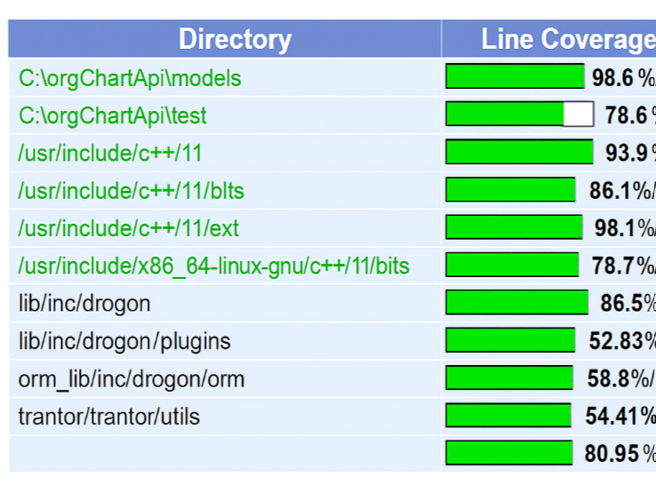
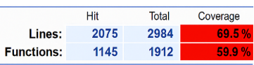

# Unit Test Generator for C++ Applications

This project automatically generates unit tests for C++ code using a Large Language Model (LLM) and iteratively improves test quality based on build feedback, code coverage, and logs. It is inspired by the architecture shown in the [LLM-based Test Generator Workflow](https://github.com/theleftyonee/Unit-Test-Generator-for-C-Applications).

## 🔧 Features

- Automatic unit test generation using LLM (e.g., LLaMA via Ollama)
- Build and test orchestration using CMake and GoogleTest
- Code coverage analysis via **gcov** and **LCOV**
- Iterative test refinement based on failed builds/logs
- YAML-based strict prompts for precise control
- Integration-ready with Keploy for API and system tests

---

## 📁 Project Structure

```

orgChartApi/
├── CMakeLists.txt
├── models/
├── controllers/
├── include/
├── testgen/
│   ├── prompts/        # YAML instructions for LLM
│   ├── tests/          # Generated GoogleTest files
│   ├── coverage/       # lcov reports (HTML + info)
│   └── build\_logs/     # CMake and build failure logs
├── main.cpp
└── README.md

````

---

## 🖥️ Dependencies

Make sure you have the following tools installed:

### 📦 System Requirements
| Tool        | Version         | Notes                                 |
|-------------|------------------|----------------------------------------|
| CMake       | >= 3.15          | For building the project               |
| MinGW (Windows) | or `g++`, `gcc` | For compiling C++ with coverage flags |
| Python      | >= 3.8           | For prompt orchestration               |
| Ollama      | Latest           | For running local LLaMA models         |
| LCOV        | 1.14             | For generating HTML code coverage      |
| GoogleTest  | Latest           | For writing and running tests          |

---

## 📜 Setup Instructions

### 1. Clone the Repository

```
git clone https://github.com/your-username/unit-test-generator.git
cd orgChartApi
````

### 2. Install Dependencies

Ensure you have installed:

* [Ollama](https://ollama.com/) and pulled a model:

  ```
  ollama run llama3
  ```

* GoogleTest and LCOV:

  ```
  sudo apt install lcov cmake g++ git
  ```

### 3. Build with Coverage Flags

```
mkdir build && cd build
cmake -G "MinGW Makefiles" .. -DCMAKE_BUILD_TYPE=Debug -DCMAKE_CXX_FLAGS="--coverage"
mingw32-make
```

### 4. Run Tests

```
ctest --output-on-failure
```

### 5. Generate Coverage Report

```
lcov --directory . --capture --output-file coverage.info
genhtml coverage.info --output-directory testgen/coverage
```

Open `testgen/coverage/index.html` in your browser.

---

##  Coverage Report

Generated using `LCOV version 1.14`








---

## 🤖 LLM Integration Flow

1. Source files are sent to the LLM along with YAML prompts.
2. LLM returns test code (`test_*.cpp`) stored in `testgen/tests`.
3. On build failure, logs are captured and sent back to the LLM for debugging.
4. The cycle repeats until build passes and coverage is optimal.

---

## 🧠 Prompting Guidelines

See `testgen/prompts/strict.yaml` for sample YAML strict-mode prompt used with LLaMA.

---

## 📌 TODO

* [ ] Add support for CLI LLMs like `llama.cpp`
* [ ] Automate rebuilds via Python script
* [ ] Add GitHub Actions for CI test + coverage validation

---

## 📬 Contact

**Isha Raj**
✉️ [isha54work@gmail.com](mailto:isha54work@gmail.com)
🔗 [LinkedIn](https://www.linkedin.com/in/isha-raj-223184250/)
🐙 [GitHub](https://github.com/isha54ry)

---


